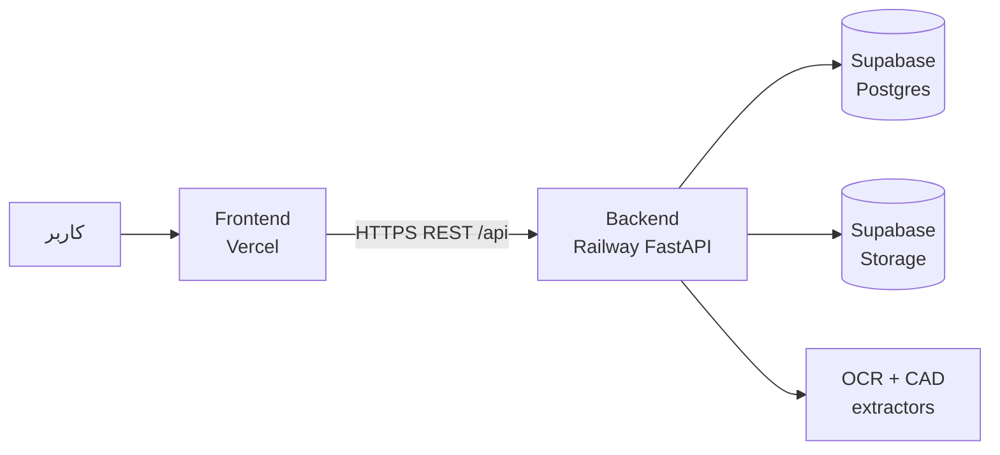
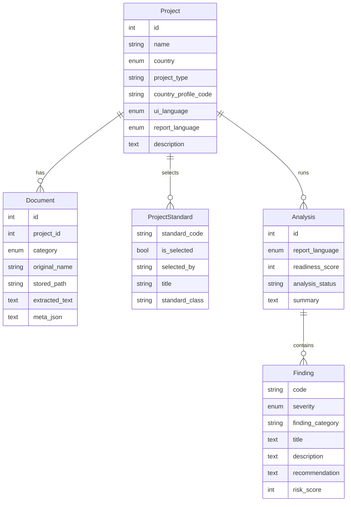
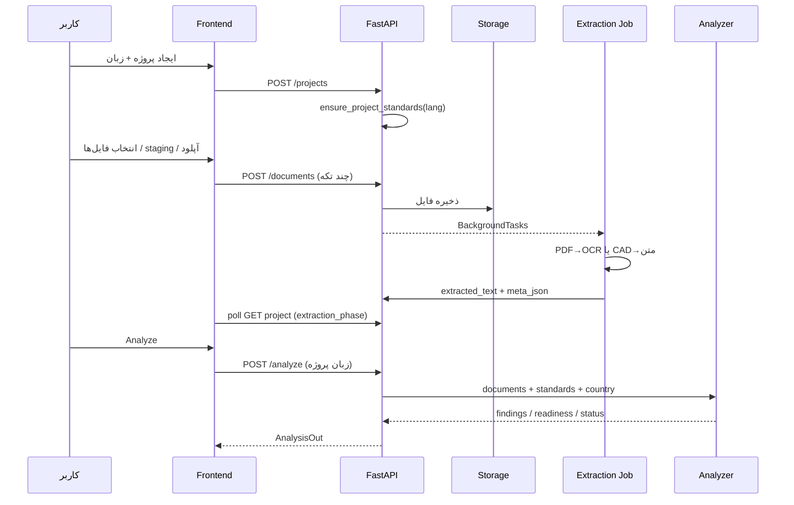
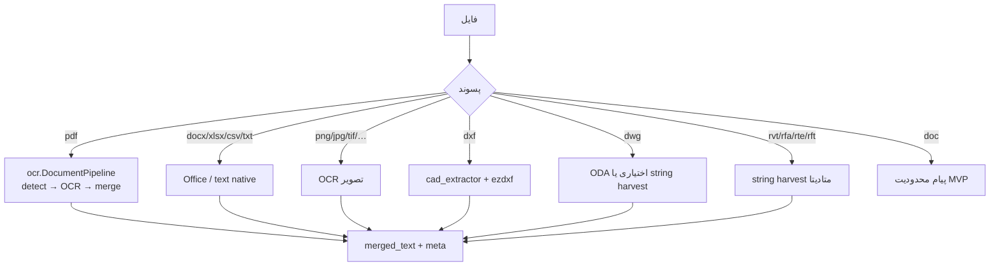
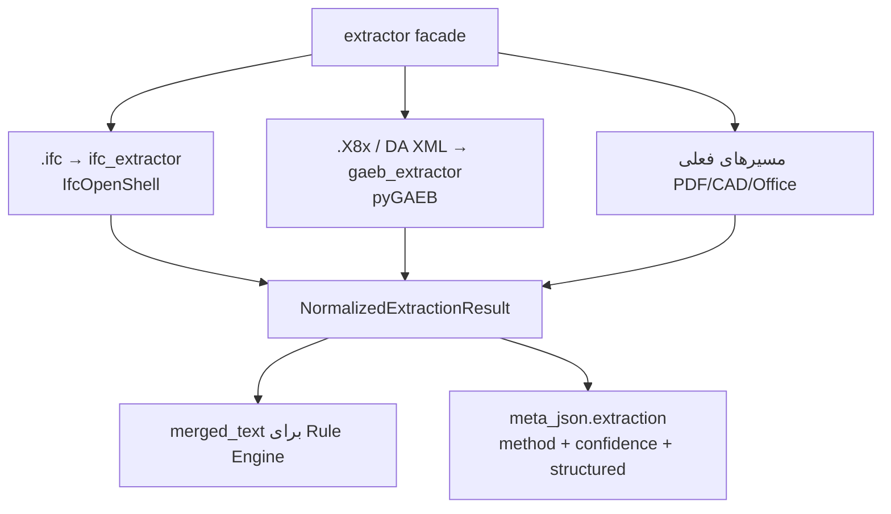
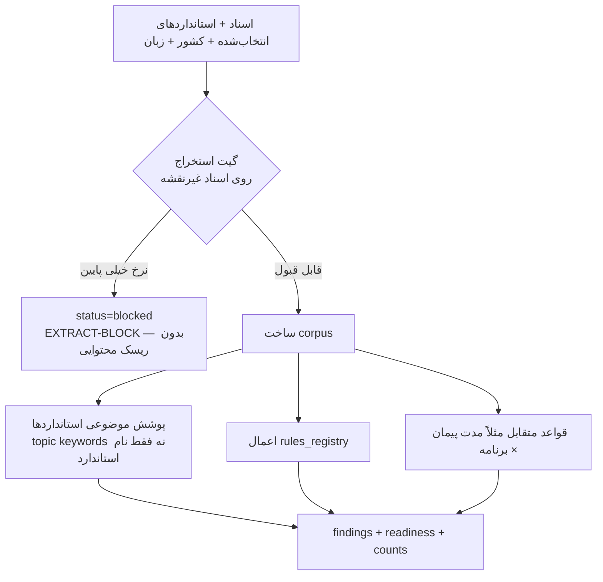

# معماری سیستم TenderRisk Analyzer / TenderRisk AI

سند وضعیت معماری تا این لحظه — شامل آنچه **پیاده‌سازی شده** و آنچه **طراحی‌شده و در صف پیاده‌سازی** است (IFC / GAEB).

---

## ۱. هدف محصول

پلتفرم وب برای تحلیل **ریسک مناقصه ساختمانی از نگاه کارفرما (Employer)**.

کاربر:
1. پروژه می‌سازد (کشور، نوع پروژه، زبان)
2. اسناد مناقصه، نقشه/مدل، برنامه زمان‌بندی و استاندارد را بارگذاری می‌کند
3. استانداردهای پیشنهادی را تأیید/اصلاح می‌کند
4. تحلیل را اجرا می‌کند و یافته‌های ریسک (severity، توصیه، زنجیره علت–معلول) می‌گیرد

**نیست:** متره کامل، BIM viewer سه‌بعدی، یا جایگزینی مشاور حقوقی.  
**هست:** استخراج متن/متادیتا + موتور قواعد کشورمحور + پوشش موضوعی استانداردها روی corpus اسناد.

کشورهای پروفایل‌شده فعلی: **ایران (IR)**، **آلمان (DE)**، **کانادا (CA)**، به‌همراه EU به‌عنوان پروفایل الحاقی.

---

## ۲. استقرار و اجزای زیرساختی

| لایه | تکنولوژی | میزبانی | نقش |
|------|-----------|---------|-----|
| Frontend | React + Vite + TypeScript | **Vercel** | UI کاربر، i18n، آپلود، نمایش یافته‌ها |
| Backend API | FastAPI + SQLAlchemy async | **Railway** (Docker) | API، OCR، CAD extract، تحلیل |
| Database | PostgreSQL | **Supabase** | پروژه‌ها، اسناد، استانداردها، تحلیل‌ها |
| Object storage | Supabase Storage (یا دیسک محلی) | **Supabase** / local | فایل‌های آپلودشده |
| OCR runtime | Tesseract (fa/de/en) + RapidOCR | داخل image بک‌اند | PDF/تصویر اسکن‌شده |



### چرا این تقسیم؟
- OCR و پردازش فایل سنگین روی Vercel serverless مناسب نیست → بک‌اند روی Railway.
- فایل‌ها و DB روی Supabase یکپارچه‌اند؛ در حالت بدون env سوپابیس، بک‌اند به SQLite + `storage/` محلی برمی‌گردد.

### Health
- `GET /api/health`
- `GET /api/health/detail` — وضعیت storage / DB / OCR
- `GET /api/health/db` — تشخیص drift اسکیما

---

## ۳. ساختار مخزن

```
standard/
├── frontend/                 # Vite React
│   └── src/
│       ├── App.tsx           # جریان اصلی UI
│       ├── BulkFileList.tsx  # انتخاب گروهی / حذف
│       ├── api.ts            # کلاینت API + FILE_ACCEPT
│       ├── i18n.ts           # FA / EN / DE / FR
│       └── App.css
├── backend/
│   ├── Dockerfile / requirements.txt
│   └── app/
│       ├── main.py
│       ├── config.py
│       ├── database.py
│       ├── models.py / schemas.py
│       ├── routers/projects.py      # تقریباً همه endpointها
│       ├── services/
│       │   ├── storage.py
│       │   ├── extractor.py         # Facade استخراج
│       │   ├── cad_extractor.py     # DXF / DWG / Revit
│       │   ├── extraction_jobs.py   # BackgroundTasks
│       │   ├── analyzer.py          # موتور ریسک
│       │   ├── project_standards.py
│       │   └── ocr/                 # Pipeline ماژولار PDF
│       └── knowledge/
│           ├── country_profiles.py
│           ├── standards_catalog.py
│           ├── rules_registry.py
│           ├── document_templates.py
│           └── prompt_templates.py
├── supabase/
│   ├── schema.sql                         # MVP زنده
│   ├── schema_additive_country_logic.sql
│   └── schema_ctkm*.sql                   # مدل کامل بعدی
└── README.md / SETUP-FA.md
```

---

## ۴. مدل داده (دامنه)

### موجودیت‌های اصلی



### دسته‌بندی اسناد (`DocumentCategory`)
| مقدار | معنی | نقش در گیت آمادگی | نقش در corpus |
|-------|------|-------------------|---------------|
| `tender` | اسناد مناقصه / پیمان / BOQ | بله | بله |
| `drawing` | نقشه / مدل CAD-BIM | **خیر** (مسدودکننده نیست) | بله اگر متن قابل‌استفاده داشته باشد |
| `schedule` | برنامه زمان‌بندی | بله | بله |
| `standard` | فایل استاندارد سفارشی | بله | بله |

### زبان
- فیلدهای `ui_language` و `report_language` در مدل هستند، اما **سیاست فعلی محصول: یک زبان واحد** برای کل UI و تحلیل؛ هر دو با هم sync می‌شوند.
- زبان‌ها: `fa` | `en` | `de` | `fr`
- جهت: فارسی RTL، بقیه LTR

### متادیتای استخراج (`Document.meta_json`)
امروز عمدتاً پیشرفت OCR/pipeline:

```json
{
  "extraction": {
    "phase": "queued|converting|ocr|extracting|merging|completed|failed",
    "progressPercent": 0,
    "message": "...",
    "pdfKind": "...",
    "pageCount": 0,
    "needsManualReview": false
  }
}
```

**طراحی بعدی (هنوز کامل در اسکیما جدا نشده):** افزودن `method` و `confidenceScore` و `structured` داخل همین envelope برای IFC/GAEB/CAD.

---

## ۵. API سطح بالا

پریفیکس: `/api/projects`

| متد | مسیر | کار |
|-----|------|-----|
| GET | `/` | لیست پروژه‌ها |
| POST | `/` | ایجاد پروژه + seed استانداردها |
| GET/PATCH/DELETE | `/{id}` | خواندن / به‌روزرسانی / حذف |
| GET/PUT | `/{id}/standards` | فهرست و toggle استانداردها |
| POST | `/{id}/documents` | آپلود چندفایلی (async extract) |
| DELETE | `/{id}/documents/{docId}` | حذف یک فایل |
| POST | `/{id}/documents/bulk-delete` | حذف گروهی (+ `force` برای ارجاع‌شده‌ها) |
| POST | `/{id}/documents/{docId}/reextract` | صف استخراج مجدد |
| POST | `/{id}/analyze` | اجرای موتور ریسک |
| GET | `/{id}/analyses/latest` | آخرین تحلیل |

آپلود chunkشده از فرانت (`UPLOAD_CHUNK_SIZE = 4`) برای جلوگیری از timeout پروکسی.

---

## ۶. جریان سرتاسری (End-to-End)



---

## ۷. لایه استخراج (Extraction Architecture)

### ۷.۱ Facade

`services/extractor.py` نقطه ورود واحد است:

- `extract_text_from_file(path, allow_ocr=..., treat_as_drawing=...)`
- `extract_document_full(...)` → نتیجه ساخت‌یافته برای job
- `has_usable_text(...)` → معیار «متن قابل‌استفاده برای تحلیل»
- `SUPPORTED_EXTENSIONS` — فیلتر آپلود سمت سرور

فرانت هم‌تراز با `FILE_ACCEPT` در `api.ts`.

### ۷.۲ Routing فعلی (پیاده‌سازی‌شده)



### ۷.۳ Pipeline OCR (PDF)

بسته `services/ocr/`:

| جزء | نقش |
|-----|-----|
| `classifier` | نوع صفحه: searchable / scanned / mixed / empty |
| `pipeline` | تبدیل صفحه، OCR، ادغام |
| `factory` | انتخاب provider |
| `tesseract_provider` | fa / de / eng |
| `rapidocr_provider` | fallback ONNX |
| `types` | `ExtractionPhase`, `DocumentExtractionResult`, … |

استخراج **همزمان با آپلود بلاک نمی‌شود**؛ `extraction_jobs.process_document_extraction` در BackgroundTask اجرا می‌شود و UI پیشرفت را از `meta_json` می‌خواند.

### ۷.۴ CAD فعلی (`cad_extractor.py`)

| فرمت | روش | کیفیت تقریبی |
|------|-----|--------------|
| **DXF** | ezdxf: لایه‌ها، TEXT/MTEXT، ATTRIB، بلوک‌ها | ساخت‌یافته نسبی |
| **DWG** | ODA→DXF اگر موجود؛ وگرنه harvest باینری | متوسط/ضعیف |
| **Revit** | harvest ASCII/UTF-16 از باینری | متوسط/ضعیف — نه geometry API |

متن CAD در تحلیل وارد corpus می‌شود؛ نبود متن روی نقشه **تحلیل را مسدود نمی‌کند** (گیت فقط اسناد متنی غیرنقشه را می‌شمارد).

### ۷.۵ طراحی بعدی — IFC و GAEB (تصویب‌شده، در صف کد)



#### IFC (اولویت بالا برای مدل/نقشه)
- کتابخانه: **IfcOpenShell** (`pip install ifcopenshell`) — LGPL، بدون SDK اختصاصی
- استخراج: سلسله‌مراتب فضایی (Site/Building/Storey/Space)، عناصر بر اساس نوع IFC، PropertySet / ElementQuantity (از جمله fire rating در صورت وجود)
- دسته آپلود: `drawing`
- `extraction_method`: `ifc_native` — بالاترین اطمینان سمت مدل

#### GAEB (BOQ آلمان)
- کتابخانه پیشنهادی: **pyGAEB** برای **GAEB DA XML** (۲.۰–۳.۳)، فازهای مهم کارفرما: X81–X83
- پسوندهای رایج: `.X81`–`.X86`؛ `.D8x` ممکن است XML قدیمی یا GAEB 90 باشد → نیاز به sniff
- **GAEB 90 / ثابت‌عرض:** هنوز شکاف؛ فاز ۲
- دسته آپلود: `tender` (LV/BOQ)
- خروجی ساخت‌یافته: `{ code, description, qty, unit, unit_price? }[]` در `structured`
- قالب دانش از قبل: `BOQ_GAEB` در `document_templates.py` برای کشور DE

#### سلسله‌مراتب کیفیت ورودی (برای UI و confidence)

| method | باند confidence | کاربرد |
|--------|-----------------|--------|
| `ifc_native` | 90–98 | مدل BIM باز |
| `gaeb_native` | 90–98 | LV آلمان ساخت‌یافته |
| `dxf_native` | 70–85 | CAD متن/لایه |
| `dwg_harvest` / `rvt_harvest` | 40–60 | استنتاج از باینری |
| `pdf_drawing_vision` | 35–55 | (طراحی آینده) |
| `pdf_drawing_ocr` | 20–45 | اسکن |

---

## ۸. لایه دانش (`knowledge/`)

منطق کشورمحور **در کد** است (نه فقط DB):

| ماژول | نقش |
|-------|-----|
| `country_profiles.py` | پروفایل IR/DE/CA/…، boq_format، ruleset پیش‌فرض، hintهای قراردادی |
| `standards_catalog.py` | کاتالوگ استاندارد + `title_for(lang)` + applicability(کشور×نوع پروژه) |
| `project_standards.py` | seed/sync ردیف‌های `ProjectStandard` بدون overwrite انتخاب دستی کاربر |
| `rules_registry.py` | قواعد ریسک (نبود نقشه، LV/GAEB، پوشش استاندارد، زمان‌بندی، …) |
| `document_templates.py` | شکل سند (مثلاً `BOQ_GAEB`, `BOQ_FEHREST_BAHA`) |
| `prompt_templates.py` | قالب‌های پرامپت (مسیر اختیاری/آینده AI) |

انتخاب استاندارد پیش‌فرض = f(کشور، نوع پروژه). کاربر می‌تواند override کند (`selected_by = user_override`).

---

## ۹. موتور تحلیل (`analyzer.py`)



### اصول کلیدی
1. **Hard gate:** اگر اسناد متنی (غیرنقشه) خوانا نباشند → تحلیل مسدود؛ ریسک محتوایی ادعا نمی‌شود.
2. **نقشه در gate شمرده نمی‌شود** تا CAD خالی کل پروژه را قفل نکند.
3. **Corpus قواعد** از همه اسناد دارای `has_usable_text` (شامل نقشه CAD خوانا و در آینده IFC/GAEB).
4. **یافته‌ها چندزبانه** از دیکشنری‌های قانون/`_lang` بر اساس زبان پروژه.
5. **دسته‌بندی یافته:** `risk` | `limitation` | `methodology`
6. **امتیاز ریسک** و severity از score؛ برچسب impact محلی‌سازی می‌شود (`بالا/متوسط/پایین` و معادل‌ها).

### ورودی corpus موضوعی (فعلی + طراحی)
```
technical_corpus ≈ tender_text + standard_text + drawing_text(+ IFC)
contract_corpus  ≈ tender_text (+ GAEB flattened items)
```

---

## ۱۰. Frontend

- تک‌اپلیکیشن در `App.tsx` (لیست پروژه / جزئیات / آپلود / استاندارد / تحلیل)
- `BulkFileList`: انتخاب همه، حذف انتخاب‌شده، حذف همه، وضعیت استخراج، reextract
- Staging قبل از آپلود برای فیلتر فایل‌ها
- **یک انتخابگر زبان** برای کل برنامه؛ با ذخیره روی پروژه sync می‌شود
- راهنمای کیفیت ورودی (مفهومی، در حال تکمیل کپی):
  - نقشه: IFC/DXF > DWG/Revit > PDF
  - BOQ آلمان: GAEB ≫ PDF/Excel

---

## ۱۱. Storage

`services/storage.py`:
- اگر `SUPABASE_URL` + service role ست باشد → آپلود به bucket با کلید ASCII امن
- در غیر این صورت → فایل محلی زیر `storage/`
- برای OCR همیشه یک مسیر محلی موقت/خواندنی لازم است (کپی از Supabase در صورت نیاز)

---

## ۱۲. امنیت و محدودیت‌های عملیاتی (وضعیت فعلی)

- احراز هویت کاربر نهایی هنوز در MVP عمومی‌سازی نشده (API پروژه‌محور)
- سقف حجم آپلود قابل تنظیم (`max_upload_mb`؛ ۰ = بدون سقف نرم‌افزاری)
- فایل‌های بسیار بزرگ Revit/IFC نیاز به محدودیت زمان job و سیاست «بدون mesh» دارند (به‌ویژه پس از افزودن IFC)
- CORS برای localhost و `*.vercel.app`

---

## ۱۳. نقشه راه لایه‌ای (از دید معماری)

| لایه | وضعیت |
|------|--------|
| پروژه + اسناد + استاندارد + تحلیل قاعده‌محور | **پیاده‌سازی‌شده** |
| OCR async چندزبانه PDF | **پیاده‌سازی‌شده** |
| DXF / DWG / Revit text extract | **پیاده‌سازی‌شده** |
| زبان واحد UI+گزارش | **پیاده‌سازی‌شده** |
| IFC native (IfcOpenShell) + confidence | **پیاده‌سازی‌شده** |
| GAEB DA XML (pyGAEB) برای DE | **پیاده‌سازی‌شده** |
| GAEB 90 fixed-width | **شناخته‌شده — فاز ۲** |
| cross-check GAEB ↔ IFC/DXF quantities | **طراحی مفهومی — پس از native parsers** |
| اسکیمای کامل CTKM در DB | **فایل آماده — مهاجرت کامل انجام نشده** |

---

## ۱۴. جمع‌بندی یک‌خطی معماری

> **Vercel UI → Railway FastAPI → استخراج async (OCR/CAD و به‌زودی IFC/GAEB) → ذخیره متن+meta در Supabase → موتور دانش کشورمحور + قواعد → یافته‌های ریسک چندزبانه برای کارفرما.**

این سند مرجع معماری «تا اینجا» است و باید با هر تغییر بزرگ در extractor یا مدل داده به‌روز شود.
